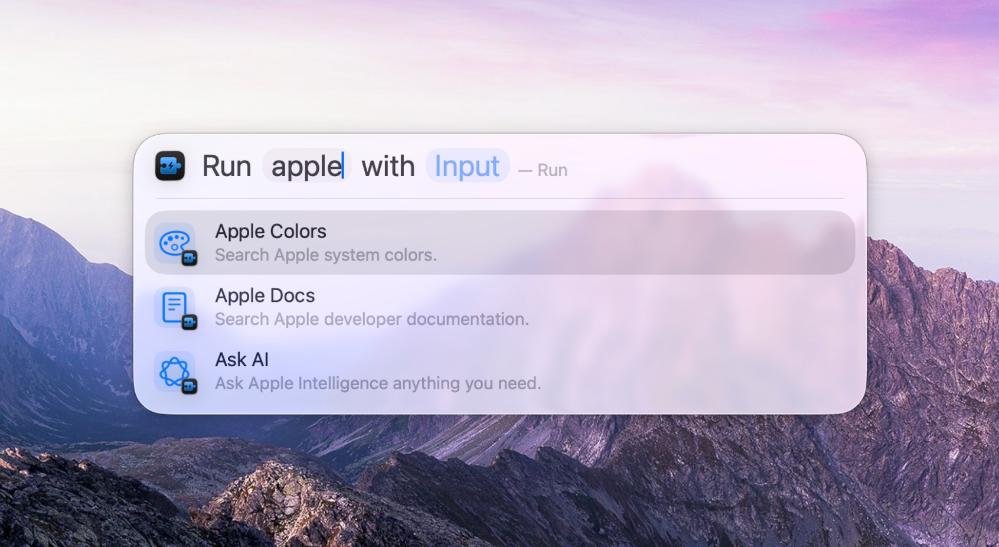
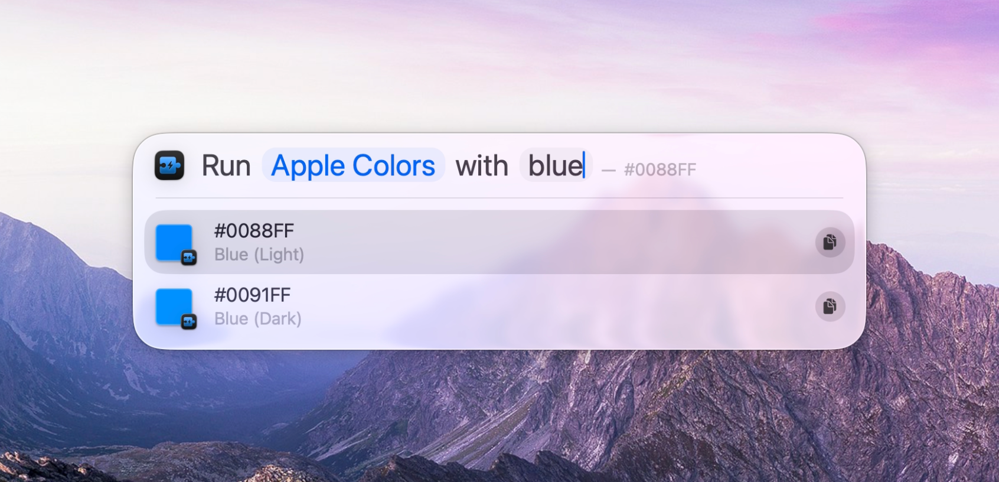

# Intentify

  

Extends [Spotlight](https://support.apple.com/guide/mac-help/mchlp1008/mac) by running JavaScript, with [Apple Intelligence](https://www.apple.com/apple-intelligence/) support.

> [!TIP]
> Discover our other free and open-source apps at [libremac.github.io](https://libremac.github.io/).

## Installation

Get `Intentify.dmg` from the <a href="https://github.com/Intentify-app/Intentify/releases/latest" target="_blank">latest release</a>, open it and drag `Intentify.app` to `Applications`.

Intentify checks for updates automatically, you can also browse version history [here](https://github.com/Intentify-app/Intentify/releases).

## How to Use

Open the app to see how it works. The main app is an interactive user guide to help you get started.

For advanced skills, check out the [wiki](https://github.com/Intentify-app/Intentify/wiki).

## Why Intentify

I have been using Alfred for over a decade (I know there is Raycast, thanks), but recently I found that Spotlight in macOS 26 is not bad. In particular, it can now run [Shortcuts](https://support.apple.com/guide/shortcuts-mac/welcome/mac) actions inline with input.

As someone who relies primarily on first-party apps, I have decided to give Spotlight another try.

Since Shortcuts' built-in scripting has [many limitations](https://github.com/Intentify-app/Intentify/wiki#why-intentify-is-better), I created this tool to make extending it easier.

I may add more features in the future (such as more extensible or better result display), but do not expect it to compete with Alfred or Raycast.

I love simple things.
